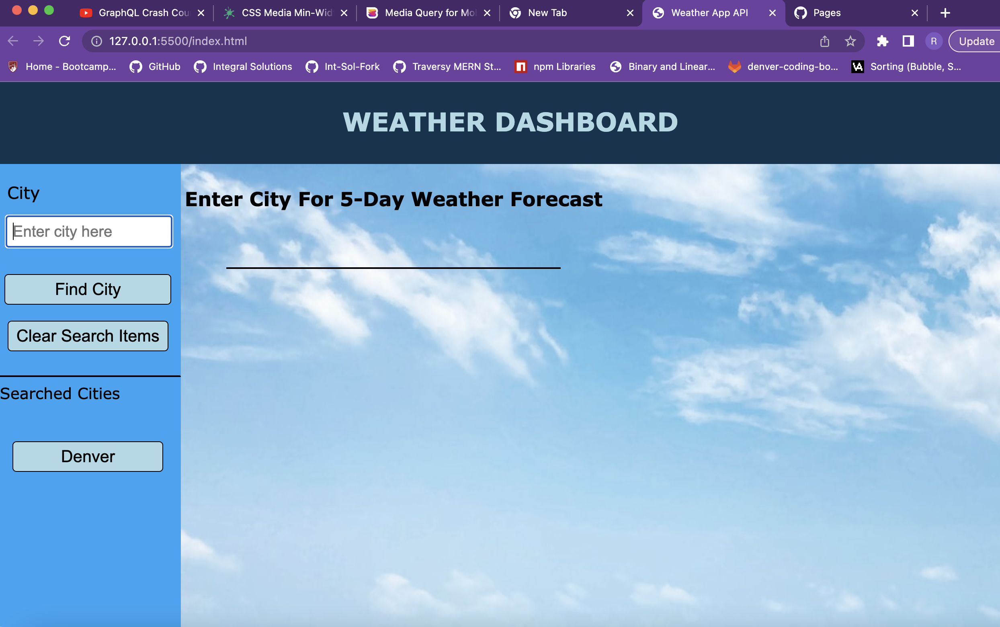
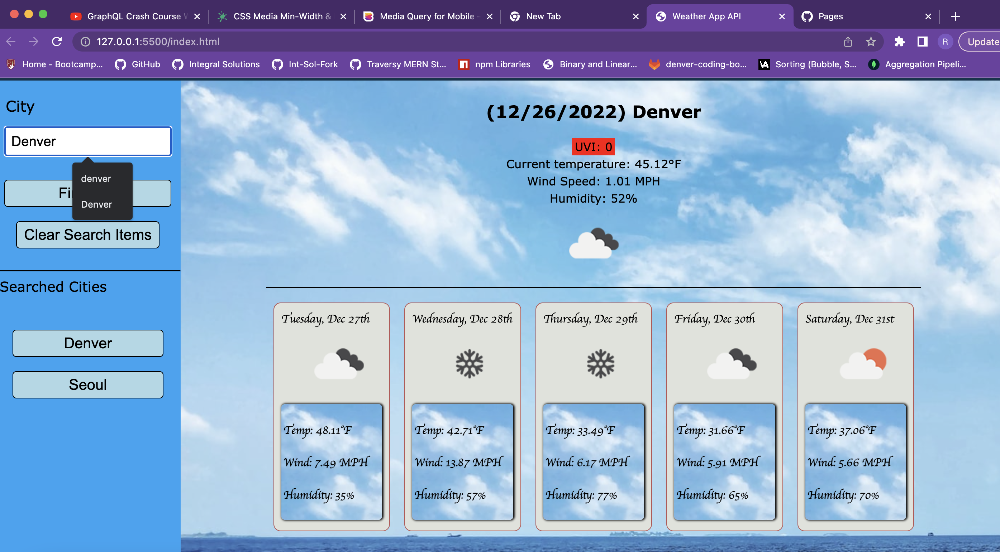
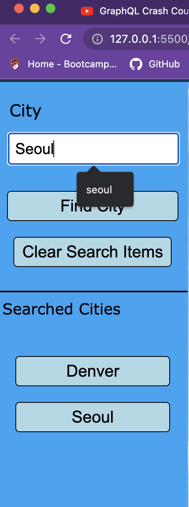

# 🌦 Weather Forecast Dashboard 🌦

[](https://opensource.org/licenses/MIT)

## Overview

In this coding bootcamp assignment, I created a weather forecast app with the Open Weather 3rd-party API to search for 5-day forecasts everywhere around the world. 

### [Github Pages Deployment Link](https://rodbennett.github.io/06-weather-app-challenge/)

## Table of Contents
1. [Acceptance Criteria](#acceptance-criteria)
2. [Features](#features)
3. [Static Screenshots](#static-screenshots)
4. [Technologies](#technologies)
5. [Challenges](#challenges)
5. [Future Enhancements](#future-enhancements)
6. [Licence](#license)
6. [Contributors](#contributors)

## Acceptance Criteria

```
GIVEN a weather dashboard with form inputs
WHEN I search for a city
THEN I am presented with current and future conditions for that city and that city is added to the search history
WHEN I view current weather conditions for that city
THEN I am presented with the city name, the date, an icon representation of weather conditions, the temperature, the humidity, the wind speed, and the UV index
WHEN I view the UV index
THEN I am presented with a color that indicates whether the conditions are favorable, moderate, or severe
WHEN I view future weather conditions for that city
THEN I am presented with a 5-day forecast that displays the date, an icon representation of weather conditions, the temperature, the wind speed, and the humidity
WHEN I click on a city in the search history
THEN I am again presented with current and future conditions for that city
```

## Features

This app features a number of JavaScript methods and functions that were new to us in coding bootcamp.  The first and foremost of these was the fetch() method for retrieving data from a 3rd-party API.  This app also features dynamically rendered elements such as buttons when ceratin cities are searched, local storage functionality, as well as clearing local storage functionality. 

This app is also media queried for mobile use.

## Static Screenshots

- ### Homepage



- ### 5-day forecast cards  



- ### Searched city buttons column



## Technologies

- HTML
- CSS
- JavaScript
- Open Weather API

## Challenges

1. Getting the dynamically rendered buttons hooked up to local storage to retrieve the correct data set for that particular past search
2. Linking ```lat and lon``` with ```city names``` for searches
3. Understanding the dynamic creation of elements through JS
4. Completing this in a timely fashion while also working on our first group project

This was definitely a challenging assignment, but my understanding of JavaScript and its power of dynamic creation of elements have been greatly enhanced as a result of doing it.   

## Future Enhancements

1. Use customized icons
2. Have UVI dynamically colored according to value (parseInt())

## License

[](https://opensource.org/licenses/MIT)

## Contributors
Coded with ❤️ by [Rod Bennett](https://github.com/RodBennett)

Email: rod.bennett75@gmail.com